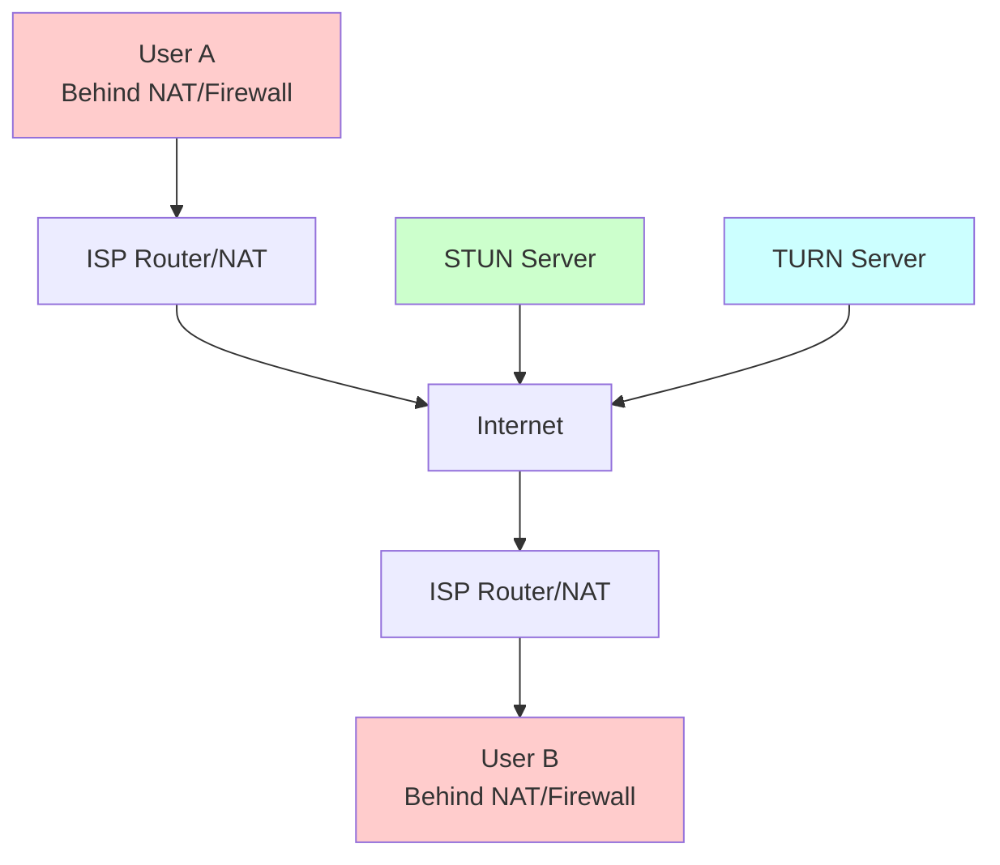
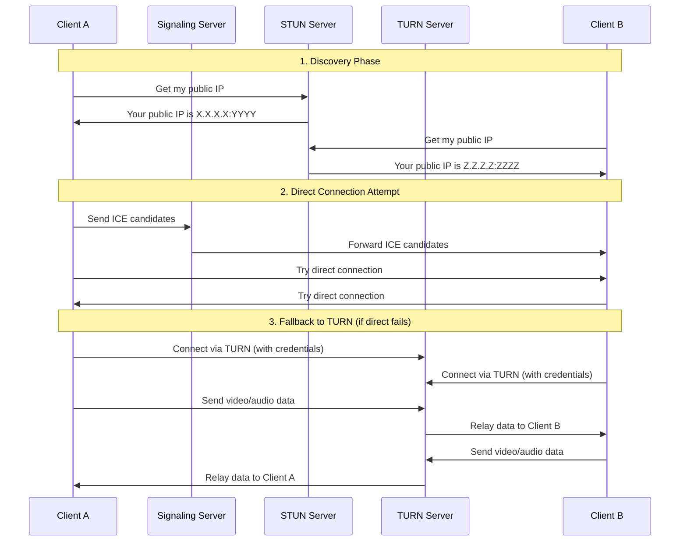

# Why TURN Servers Are Essential for WebRTC Applications

## The NAT/Firewall Problem

WebRTC is designed for peer-to-peer communication, but in practice, most users are behind NAT (Network Address Translation) and firewalls that prevent direct connections. Here's why TURN servers are crucial:

### Network Topology Reality



### NAT Types and Connection Success Rates

| NAT Type | Direct P2P Success | Requires TURN |
|----------|-------------------|---------------|
| **Full Cone** | ✅ ~95% | Rarely |
| **Restricted Cone** | ✅ ~80% | Sometimes |
| **Port Restricted** | ⚠️ ~60% | Often |
| **Symmetric NAT** | ❌ ~10% | **Always** |

**Reality Check:** 15-30% of users are behind Symmetric NAT or corporate firewalls that block peer-to-peer connections entirely.

## What Each Component Does

### STUN Servers (Session Traversal Utilities for NAT)
- **Purpose**: Help clients discover their public IP address and port
- **Function**: "What's my public IP as seen from the internet?"
- **Cost**: Usually free (Google, Twilio provide public STUN servers)
- **Limitation**: Only works for simple NAT scenarios

### TURN Servers (Traversal Using Relays around NAT)
- **Purpose**: Relay traffic when direct P2P connection fails
- **Function**: Act as a relay/proxy for media streams
- **Requirement**: Authentication (username/password) to prevent abuse
- **Cost**: Paid service (consumes bandwidth and server resources)

## Why Authentication Is Required

TURN servers are expensive to operate because:
1. **Bandwidth Costs**: All video/audio data flows through the server
2. **Server Resources**: CPU and memory intensive
3. **Abuse Prevention**: Without auth, servers would be overwhelmed by unauthorized users

## WebRTC Connection Flow



## Production Requirements

### Without TURN Server
- ❌ 15-30% of users **cannot connect at all**
- ❌ Corporate networks often block connections
- ❌ Mobile networks with Symmetric NAT fail
- ❌ Users behind strict firewalls are excluded

### With TURN Server
- ✅ **99%+ connection success rate**
- ✅ Works in corporate environments
- ✅ Mobile networks fully supported
- ✅ Fallback for any network topology

## Popular TURN Server Providers

### Cloud Providers
- **Twilio** - Pay per GB transferred, global edge locations
- **Xirsys** - WebRTC infrastructure specialist  
- **Amazon Kinesis Video Streams** - Integrated with AWS
- **Agora** - Real-time communication platform

### Self-Hosted Options
- **coturn** - Open source TURN server (requires setup/maintenance)
- **Janus Gateway** - WebRTC gateway with TURN capabilities

### Cost Estimates
- **Light usage** (10-50 concurrent users): $20-100/month
- **Medium usage** (100-500 concurrent): $200-500/month  
- **Heavy usage** (1000+ concurrent): $1000+/month

## Configuration in Our Application

The WebRTC service tries connections in this order:

1. **STUN-only** (direct P2P with public IP discovery)
2. **TURN relay** (if direct fails)

```javascript
// ICE servers configuration in WebRTCService
const iceServers = [
  // Free STUN servers (always included)
  { urls: "stun:stun.l.google.com:19302" },
  { urls: "stun:global.stun.twilio.com:3478" },
  
  // TURN servers (when credentials provided)
  {
    urls: ["turns:turn1.example.com:443", "turns:turn2.example.com:443"],
    username: "user",
    credential: "password"
  }
];
```

## Development vs Production

### Development/Testing
- Can start with **STUN-only** for basic testing
- Works fine when testing locally or on same network
- Limited success rate when testing across different networks

### Production Deployment
- **TURN servers are mandatory** for reliable service
- Users expect video calls to "just work"
- Connection failures result in poor user experience and app abandonment

## Deployment Options

### Option 1: Skip TURN for Initial Testing
```bash
# Deploy without TURN credentials (STUN-only)
# 70-85% connection success rate
./deploy-azure.sh
# (Leave TURN fields empty when prompted)
```

### Option 2: Add TURN for Production
```bash
# Deploy with TURN server credentials
# 99%+ connection success rate
VITE_TURN_URLS="turns:global.turn.twilio.com:443"
VITE_TURN_USERNAME="your-twilio-username"  
VITE_TURN_PASSWORD="your-twilio-password"
```

### Option 3: Set up your own TURN server
```bash
# Install coturn on a VM
sudo apt install coturn
# Configure /etc/turnserver.conf
# Open firewall ports: 3478, 5349, 10000-20000
```

## Key Takeaways

1. **STUN servers are free and always included** - help with basic NAT traversal
2. **TURN servers cost money but are essential** - ensure universal connectivity  
3. **Start with STUN for testing**, add TURN before production launch
4. **15-30% of users will be unable to connect** without TURN servers
5. **Authentication prevents abuse** of expensive TURN server resources

The deployment guides provide configuration for both scenarios - you can start without TURN for testing, then add TURN credentials later for production reliability.